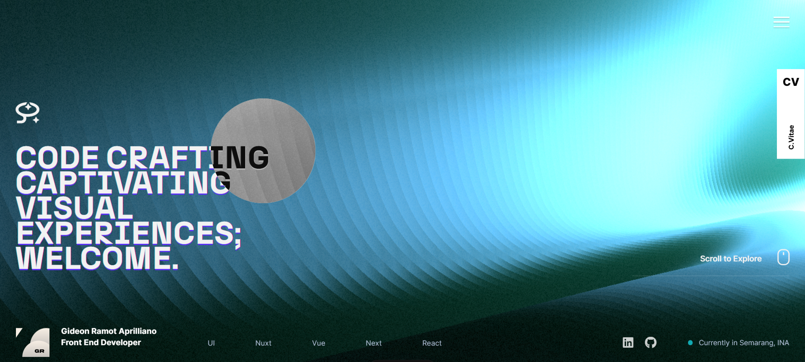

# Gideon Ramot's Portfolio



This repo contains the latest code for https://gideonrap.vercel.app. It's a Nuxt 3 project that centers around a WebGL visualization that ebs and flows into each page.

I've made the code open-source, with the obvious caveat that it's meant to act as a reference for learning and developing your own creative website, and that you cannot clone it and pretend to be me.

### Technology 🚀

- Nuxt 3 / Vue 3
- Notion _(CMS)_
- Cloudinary _(Media Delivery)_
- Heroku _(Deployment)_
- CloudFlare _(DNS)_

## Setup

Make sure to install the dependencies:

```bash
# yarn
yarn install

# npm
npm install

# pnpm
pnpm install --shamefully-hoist
```

## Development Server

Runs a development server with HMR _(Hot Module Replacement)_ on http://localhost:3000

```bash
npm run dev
```

## Production

Build the application for production:

```bash
npm run build
```

Locally preview production build:

```bash
npm run preview
```

### Thanks for checking out this repo!
